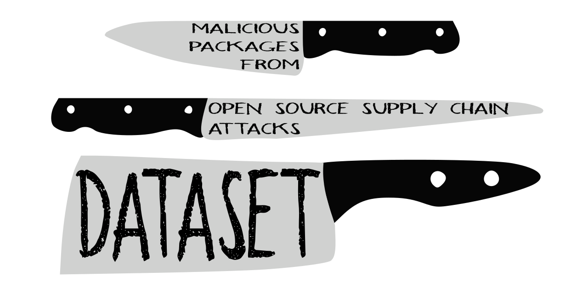

# Backstabber's Knife Collection

## WHAT IS THIS?
Landing page for the 

## CITE US
```
@inproceedings{ohm2020backstabber,
  title={Backstabber's Knife Collection: A Review of Open Source Software Supply Chain Attacks},
  author={Ohm, Marc and Plate, Henrik and Sykosch, Arnold and Meier, Michael},
  booktitle={International Conference on Detection of Intrusions and Malware, and Vulnerability Assessment},
  year={2020},
  organization={Springer}
}
```
